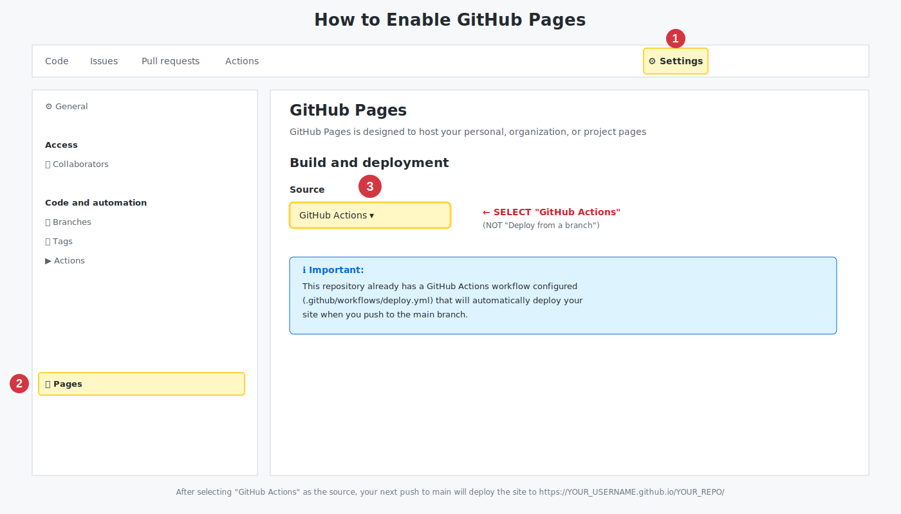

# Setup Guide

## Enabling GitHub Pages

This guide will help you enable GitHub Pages for your about-me-template repository.

### Visual Guide

See the annotated image below for step-by-step instructions:

### Quick Steps

**Step 1: Go to Settings**
- Click on the **Settings** tab in your repository (top navigation bar)

**Step 2: Navigate to Pages**
- In the left sidebar, scroll down to "Code and automation" section
- Click on **Pages**

**Step 3: Configure Source**
- Under "Build and deployment" → "Source"
- Select **"GitHub Actions"** from the dropdown
- ⚠️ **Important:** Do NOT select "Deploy from a branch"

**Step 4: Automatic Deployment**
- Once configured, your site will automatically deploy when you push to the main branch
- The workflow file (`.github/workflows/deploy.yml`) handles the deployment
- Your site will be available at: `https://YOUR_USERNAME.github.io/YOUR_REPO/`

### Why GitHub Actions?

This repository comes with a pre-configured GitHub Actions workflow that will:
- Automatically build your React application
- Deploy it to GitHub Pages on every push to the main branch
- No additional configuration needed!

### Troubleshooting

If your site doesn't deploy:
1. Check that you selected "GitHub Actions" as the source (not "Deploy from a branch")
2. Verify the workflow runs successfully in the "Actions" tab
3. Make sure you've pushed to the main branch
